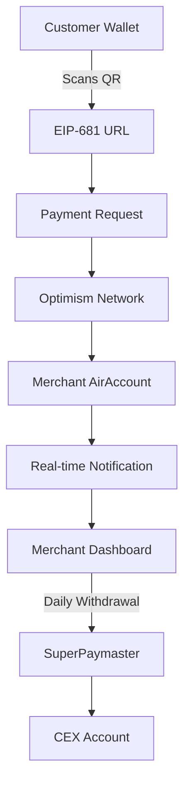

# Features - AAStar CoinJar

## Product Vision
AAStar CoinJar is a flagship application showcasing the AirAccount SDK, designed to help small/micro-merchants easily accept cryptocurrency payments. It addresses the core pain point: "Don't miss a sale" by providing a simple, secure, and decentralized payment solution.

## Target Users
- **Primary**: Small/micro-merchants (food stalls, coconut water vendors, night market vendors)
- **Secondary**: Crypto-savvy customers looking for payment flexibility
- **Tertiary**: Tourists with crypto but no local cash

## Core Value Proposition
- **For Merchants**: "Accept crypto payments in 2 minutes with just an email"
- **For Customers**: "Pay with any standard wallet on Optimism network"
- **For Ecosystem**: "Showcase AirAccount SDK capabilities in real-world scenarios"

## Feature Breakdown

### P1 Features (MVP - v0.1.x)
Focus: Merchant-centric, universal receiving

#### F1.1 Account Creation & Management
- **User Story**: As a merchant, I want to create a crypto receiving account using just my email
- **Technical Implementation**: 
  - Email-based registration using Passkey authentication
  - AirAccount creation on Optimism L2
  - Automatic ENS-style address generation
- **Success Criteria**: Account creation in < 2 minutes

#### F1.2 Universal Payment Receiving
- **User Story**: As a merchant, I want to receive payments from any standard wallet
- **Technical Implementation**:
  - EIP-681 compliant QR codes with chain ID (Optimism: 10)
  - Support for any standard wallet (MetaMask, Coinbase Wallet, etc.)
  - Real-time payment detection via WebSocket
- **Success Criteria**: Customers can pay without having AirAccount

#### F1.3 Gas-Free Experience
- **User Story**: As a merchant, I don't want to worry about transaction fees
- **Technical Implementation**:
  - SuperPaymaster integration for withdrawal sponsorship
  - Only merchant action requiring gas: daily withdrawal to CEX
  - Gas fees sponsored by platform
- **Success Criteria**: Zero gas fees for receiving payments

#### F1.4 Real-Time Payment Status
- **User Story**: As a merchant, I want immediate feedback when payment is received
- **Technical Implementation**:
  - Optimistic UI: Show "payment pending" on mempool broadcast (1-2 seconds)
  - WebSocket for real-time updates
  - Final confirmation within 60 seconds
- **Success Criteria**: Merchant sees payment status in < 5 seconds

#### F1.5 USDC-Only Support
- **User Story**: As a merchant, I want price stability for small payments
- **Technical Implementation**:
  - Only support USDC on Optimism
  - Clear UI indication: "Pay with USDC on Optimism Network"
  - Stable pricing display
- **Success Criteria**: No volatility risk for merchants

### P2 Features (Enhanced Experience - v0.2.x)
Focus: Smart routing and multi-wallet support

#### F2.1 Smart Payment Pages
- **User Story**: As a customer, I want automatic network detection and switching
- **Technical Implementation**:
  - QR codes point to smart payment URLs (pay.coinjar.io/merchant-id)
  - Automatic wallet network detection
  - One-click network switching via WalletConnect
- **Success Criteria**: Reduced user confusion about networks

#### F2.2 Enhanced Merchant Dashboard
- **User Story**: As a merchant, I want to track daily earnings and manage withdrawals
- **Technical Implementation**:
  - Daily/weekly earning summaries
  - Scheduled withdrawal suggestions
  - Transaction history with timestamps
- **Success Criteria**: Clear financial overview for merchants

#### F2.3 Multi-Chain Address Support
- **User Story**: As a merchant, I want the same address across all Superchain networks
- **Technical Implementation**:
  - CREATE2 deterministic addresses
  - Unified address display
  - Future Superchain network support
- **Success Criteria**: Single address works across supported chains

### P3 Features (Advanced - v0.3.x)
Focus: Cross-chain abstraction and mobile experience

#### F3.1 Cross-Chain Payment Abstraction
- **User Story**: As a customer, I want to pay from any chain without worrying about bridges
- **Technical Implementation**:
  - Integration with Stargate/Li.Fi for automatic bridging
  - Backend handles cross-chain complexity
  - Customers pay from Polygon, merchants receive on Optimism
- **Success Criteria**: Seamless cross-chain payments

#### F3.2 NFC Tap-to-Pay Support
- **User Story**: As a customer, I want to tap my phone to pay
- **Technical Implementation**:
  - Native mobile app with NFC support
  - Integration with device biometrics
  - Physical NFC tags for merchants
- **Success Criteria**: Sub-3-second payment flow

#### F3.3 Advanced Analytics
- **User Story**: As a merchant, I want insights into my crypto payment patterns
- **Technical Implementation**:
  - Payment analytics dashboard
  - Customer behavior insights
  - Revenue optimization suggestions
- **Success Criteria**: Actionable business insights

## Technical Architecture Overview

## Success Metrics

### P1 Success Criteria
- Account creation time: < 2 minutes
- Payment confirmation time: < 60 seconds
- User error rate: < 5%
- Network switching success rate: > 90%

### Business Metrics
- Merchant adoption rate
- Transaction volume growth
- Average transaction size
- Daily active merchants

## Risk Assessment

### Technical Risks
- **Network congestion**: Optimism L2 can handle current load
- **Wallet compatibility**: EIP-681 supported by major wallets
- **Security**: Passkey + TEE provides enterprise-grade security

### Product Risks
- **User education**: Clear UI/UX addresses crypto complexity
- **Market timing**: Small payments ready for crypto adoption
- **Competition**: First-mover advantage in AirAccount ecosystem

## Competitive Advantages
1. **Gas-free merchant experience** via SuperPaymaster
2. **Universal wallet compatibility** without requiring app downloads
3. **Decentralized security** with transparent, verifiable operations
4. **Simple onboarding** using familiar email + biometrics
5. **Real-time experience** optimized for small payment scenarios